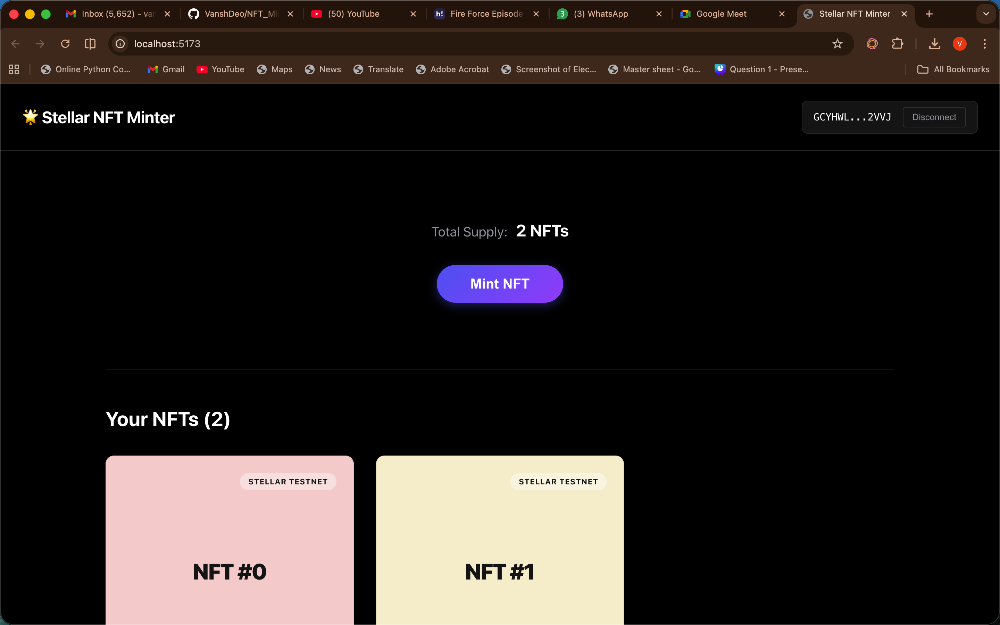
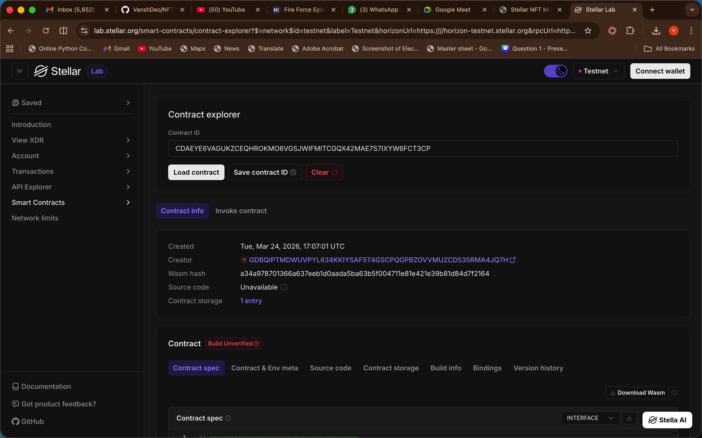

# 🎨 Stellar NFT Minter

A complete Web3 dApp for minting and managing NFTs on the **Stellar Testnet** using **Soroban Smart Contracts** and a modern **React (Vite)** frontend.

## 🌟 Overview
The Stellar NFT Minter allows users to create unique digital assets on the Stellar blockchain. Every NFT minted is a unique token on the ledger, with its metadata and ownership securely handled by our custom Soroban smart contract.

### Key Features
- **NFT Minting**: Seamlessly mint new NFTs from your browser.
- **Wallet Integration**: Powered by the **Freighter** wallet for secure signing and transactions.
- **On-chain Metadata**: Store and retrieve NFT properties directly from the Soroban state.
- **Glassmorphic UI**: A premium dark-mode dashboard designed for a state-of-the-art user experience.

---

## 📸 Previews

### Dashboard Preview


### Stellar Labs Contract View


---

## ⛓️ Smart Contract Details
- **Network**: Stellar Testnet
- **NFT Contract ID**: `CDAEYE6VAGUKZCEQHROKMO6VGSJWIFMITCGQX42MAE7S7IXYW6FCT3CP`
- **Explorer Link**: [View on Stellar Expert](https://stellar.expert/explorer/testnet/contract/CDAEYE6VAGUKZCEQHROKMO6VGSJWIFMITCGQX42MAE7S7IXYW6FCT3CP)

---

## 🚀 Getting Started

### Prerequisites
- [Node.js](https://nodejs.org/) (v18+)
- [Rust](https://www.rust-lang.org/) & Cargo (for smart contract compilation)
- [Stellar CLI](https://developers.stellar.org/docs/tools/developer-tools)
- **Freighter Wallet** browser extension configured for the **Stellar Testnet**.

### 1. Smart Contract Setup
The smart contracts are located in the `stellar-nft/contract/` directory.

```bash
# To build the contract
cd stellar-nft/contract
cargo build --target wasm32-unknown-unknown --release

# To deploy and configure automatically
cd ..
bash scripts/deploy.sh
```
*Note: The deployment script builds, optimizes, and deploys the contract, then automatically populates the `frontend/.env` file.*

### 2. Frontend Development
The frontend application lives in the `stellar-nft/frontend/` directory.

```bash
cd stellar-nft/frontend
npm install
npm run dev
```

Open `http://localhost:5173` in your browser. Ensure your Freighter wallet is connected to the **Testnet** to start minting NFTs!

---

## 🛠️ Built With
- **[Soroban](https://soroban.stellar.org/)**: Next-gen smart contracts on Stellar.
- **[Stellar SDK](https://github.com/stellar/js-stellar-sdk)**: For seamless blockchain communication.
- **[React](https://reactjs.org/) & [Vite](https://vitejs.dev/)**: For a high-performance frontend experience.
